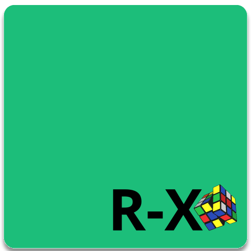

# RuculaX
RuculaX é projeto que tem como principal objetivo, entender situações repetidadas que encontramos durante o desenvolvimento de um software e resolver de uma forma mais simples.

Por Exemplo, em modelo de dominio é comum trabalharmos com entidades que herdam de Entity, onde essa entidade contém propriedades que garantem que ela seja única. Assim sendo o RuculaX contém uma classe `Entity<T>` que garante na sua herança a criação de uma identidade única.

<p align="center">

</p>

## Soluções Disponíveis
- [Identidade Única]()
- [Repositório Genérico]()
- [Repositório Genérico Concreto]()
- [Repositório Genérico Concreto de Mapeamento de Acesso a Dados ]()
- [Unidade Lógica de Trabalho]()
- [Fabrica de Query]()


# Fabrica de Query
A fabrica de query é quem cria as queries com base na sua identificação. 

## Crie a query desejada

Crie uma classe que herde de `IQuery` e passe no seu construtor o tipo de conexão que a fabrica deverá passar como argumento

```C#

public class UserQuery : IQuery
{
    QueryTestConnetion _connetion;

    public UserQuery(QueryTestConnetion connetion)
    {
        _connetion = connetion;
    }
    public async Task<IQueryConfigurationOutput> QueryAsync(IQueryConfigurationInput config)
    {
        var output = new QueryConfigurationOutput(){};
        return output;
    }
}
```

>> No nosso exemplo utilizamos `QueryTestConnetion` que é a classe usada em nossos testes, mas aqui poderia por exemplo ser um `DbContext` ou derivados.

## Adicione todas as Queries com `Queries`
Queries é uma classe abstrata que disponibiliza um método `set` e um `get`, seu objetivo principal é gerenciar as queries e suas identificações.

>> Por se tratar de classe abstrata, você deve herda-la.

```
public class QueriesDatabaseTest : Queries
{
    public QueriesDatabaseTest()
    {
        Set(nameof(User), typeof(UserQuery));
    }
}
```
>> Notem que aqui estamos amarrando "User" (nameof) com a query UserQuery(typeof)

## As Configurações Input e Output

Ao desejar criar uma query, informamos antes algumas configurações de entrada `IQueryConfigurationInput`, configurações que ajudarão a identificar o tipo desejado e o sentido da query - próximo ou anterior (**Isso se você seguir o conceito de paginação**).


Apos a criação da query, retornamos o set de dados, juntamente com as configurações de saida `IQueryConfigurationOutput`

### Options

Options é uma propriedade que guarda opções especificas para a query desejada, ela está presente tanto em input `IQueryConfigurationInput` quanto em output `IQueryConfigurationOutput`, seu tipo `string` é útil porque passamos por aqui as configurações especificas de cada query com um tipo que pode ser convertido para internamente.

```
public class UserQueryOptions
{
    public UserQueryOptions(int lastId)
    {
        LastId = lastId;
    }
    public int LastId { get; private set; } = 0;
}
```

Acima vemos um objeto de valor `UserQueryOptions` que guarda o ultimo Id de um Usuário

>> Essa propriedade é quem da a flexibilidade necessária nas queries criadas, isso ocorre porque cada query tem suas particularidades, logo, isso deve ser o mais flexivel possível.

Vejamos um exemplo

```
var userPageOne = new QueryConfigurationInput()
{
    Name = nameof(User),
    Options = "{\"LastId\": 0}"
};
```
> Notem que a representação `string` equivale ao objeto do tipo `UserQueryOptions`

## Resultado Final

```C#
var queries = new QueriesDatabaseTest(); // Identificação das queries
var connection  = new QueryTestConnetion(); // Conexão com os dados a serem manipulados
var factoryQuery = new FactoryQuery<QueryTestConnetion>(connection,queries);

var userPageOne = new QueryConfigurationInput() // Configuração inicial para obter os Usuários
{
    Name = nameof(User),
    Options = "{\"LastId\": 0}"
};
var pageOne = await factoryQuery.QueryAsync(userPageOne); // obtém o output configuration
```
Aqui **pageOne** pode ser retornado a partir de uma requisição http e utilizado em por exemplo em uma biblioteca de grid, como por exemplo o [Tabulator](https://tabulator.info/).